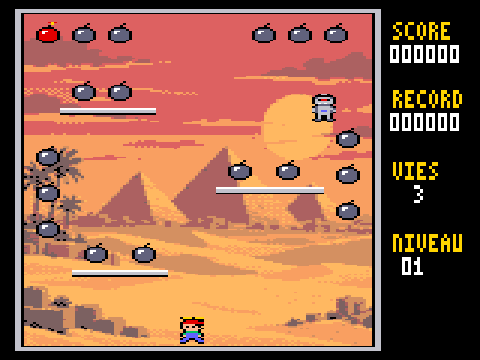
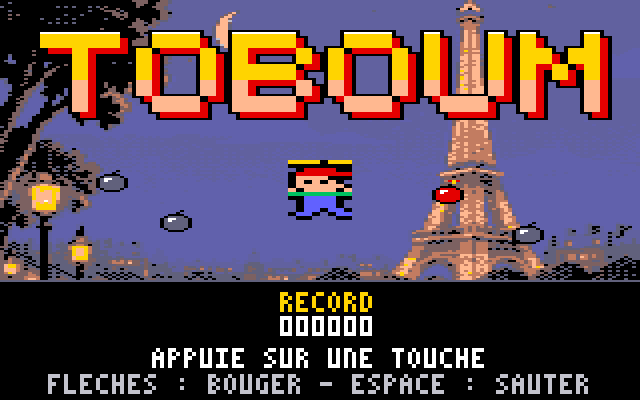
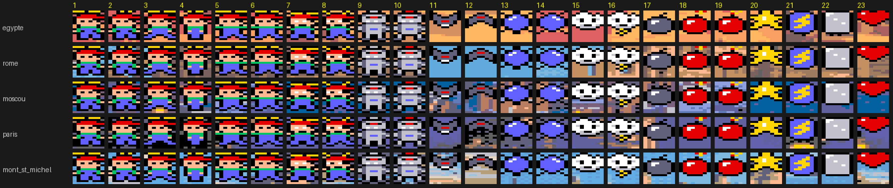
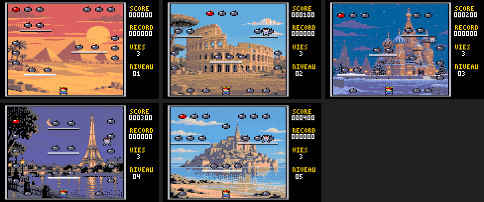

# TOboum — jeu de plates-formes pour Thomson TO9

Toto porte une casquette à hélice. Il doit ramasser les 18 bombes de chaque niveau en évitant robots, chauves-souris, boules à pics et nuages en colère. Le jeu est écrit entièrement en assembleur 6809 pour le **Thomson TO9** (1985), en 160 × 200 pixels et 16 couleurs, et testé dans l'émulateur [DCMOTO](http://dcmoto.free.fr/).

*A platform game for the Thomson TO9 8-bit computer, written in 6809 assembly (French UI).*

Le jeu a été entièrement vibecodé avec [Claude](https://claude.ai) (Anthropic) : moteur 6809, sprites, outils, simulateur et tests. Les décors ont été générés par un modèle d'image à partir de descriptions en texte ([graphismes/PROMPTS.md](graphismes/PROMPTS.md)), puis convertis pour le TO9.
*Entirely vibe-coded with Claude.*



> Version en cours de développement.

## Jouer

1. Construisez la disquette (voir plus bas) : vous obtenez `source/TOBOUM.fd`.
2. Dans DCMOTO, choisissez la machine **TO9**, puis chargez `TOBOUM.fd`.
3. Dans le menu du TO9, choisissez **3 - BASIC 128**, puis tapez `RUN"TOBOUM"`.
4. L'écran titre affiche le record : appuyez sur une touche (ou le bouton de la manette) pour jouer.

| Touche | Effet |
|---|---|
| ← → | marcher ; en l'air, Toto garde son élan |
| ↑ ou ESPACE | sauter (aux 2/3 de l'écran) ; **maintenue en retombant** : chute lente |
| ↑ de nouveau en l'air | **freiner** : Toto s'arrête un instant ; en tapotant, il plane |
| ↓ | en l'air : saut court, chute rapide, et arrêt de l'élan |
| S | bruitages oui / non |
| G | mode invincible (pour tester) : bord blanc, les ennemis ne font rien ; la partie ne compte pas pour le record |
| N | en mode invincible : passer au niveau suivant |
| F | cadence d'affichage : fixe à 25 images/s (par défaut) ou libre (50 images/s avec peu de sprites) |
| Manette 1 | directions, bouton = saut |

Le clavier du TO9 ne transmet qu'une touche à la fois : on part en courant, puis on appuie sur ↑ ; Toto garde son élan en l'air. À la manette, on peut combiner les directions et le bouton.

### Règles

- **Saut** : 10 points à chaque décollage.
- **Bombes** : une bombe éteinte rapporte 100 points ; la bombe **allumée** (rouge) en rapporte 200 et allume la suivante, toujours dans le même ordre : il y a un parcours idéal à trouver. Quand tout est ramassé, on passe au niveau suivant.
- **Bonus de chaîne** : en fin de niveau, 15 bombes allumées ramassées rapportent 10 000 points, 16 en rapportent 20 000, 17 en rapportent 30 000 et les 18, 50 000 (bord jaune).
- **Pièce éclair** : une jauge gagne 1 par bombe éteinte et 2 par bombe allumée ; à 8, une pièce éclair apparaît (2 ou 3 fois par niveau). Elle **rebondit en diagonale** sur les bords de l'aire de jeu et sur les plateformes : il faut l'attraper. La jauge ne monte pas tant que la pièce est affichée ou que le gel dure. Chaque niveau repart de zéro : jauge vide, pas de pièce. Si Toto la prend, les ennemis se changent en **glaçons** pendant 5 s (bord bleu) : chacun rapporte 100, 200, 300, 500, 800, 1 200 puis 2 000 points et disparaît. Les glaçons clignotent pendant la dernière seconde.
- **Un décor et une planche par niveau**, en boucle : Égypte (pyramides), Rome (deux corniches), Moscou (escalier), Paris (tour), Mont-Saint-Michel (terrasses). Chaque planche a ses plateformes, ses bombes, son ordre d'allumage et sa pièce éclair.
- **Ennemis** : un toutes les 3 s, jusqu'à « niveau + 3 » (8 au plus). Ils sont plus rapides à partir du niveau 3.
  - **La pression monte** : toutes les 10 s passées sur un niveau, les ennemis arrivent un peu plus souvent et les marcheurs accélèrent (6 fois au plus, jusqu'à une apparition toutes les 1,8 s).
  - le **robot** tombe, puis marche sur les plateformes. S'il atteint le sol, il clignote puis **se transforme** en volant : chauve-souris, puis boule, puis nuage, à tour de rôle ;
  - la **chauve-souris** poursuit Toto ;
  - la **boule** rebondit ;
  - le **nuage** dérive et descend vers Toto.
- **Vies** : un contact coûte une vie, sur 3 au total. À la fin de la partie, le bord devient rouge, le record est gardé, puis on revient à l'écran titre.

## Construire

Il faut `python3`, [Pillow](https://pypi.org/project/pillow/) et `lwasm` ([lwtools](http://www.lwtools.ca/)).

```sh
cd source
sh build.sh            # -> TOBOUM.BIN, DECORS.DAT et TOBOUM.fd
sh build.sh paris      # autre décor pour le niveau 1 (egypte, rome, moscou, paris, mont_st_michel)
```

### Tests

Le dossier `test/` contient un simulateur TO9 (`to9sim.py`, avec le paquet [MC6809](https://pypi.org/project/MC6809/)). Il sait reconstituer l'écran **ligne par ligne, au passage du faisceau**, pour mesurer le scintillement.

```sh
pip install pillow MC6809
cd test
python3 test_jeu.py         # saut, vol plané, bombes, ennemis, vies, niveaux, fin de partie, 40 s au hasard
python3 scintillement.py    # sprites entiers à l'écran avec 2 à 8 ennemis (--piece : pièce éclair en plus)
python3 film.py             # petit film -> apercus/toboum.gif
python3 niveaux.py          # l'écran titre et les 5 niveaux -> apercus/titre.png, niveaux.png
```

Mesures dans le simulateur, son compris :

| Ennemis | Sprites entiers à l'écran | Images/s (cadence fixe) | Images/s (cadence libre, touche F) |
|---|---|---|---|
| 2–4 | 100 % | 25 | 50 |
| 6–8 | 99,6–100 % | 25 | 25 |
| 8 + pièce | 99,5 % | 24–25 | 24–25 |

Le TO9 affiche 50 images par seconde : seules 50, 25 ou 16,7 images/s donnent un mouvement régulier. Par défaut, le jeu reste à 25 images/s quel que soit le nombre de sprites, pour garder le même aspect tout au long de la partie. La vitesse du jeu, elle, ne dépend jamais de la cadence : la logique avance au rythme de l'horloge (50 tops par seconde).

## Comment ça marche

- **Pas de sprites matériels sur le TO9.** Chaque sprite est effacé (en recopiant une copie du décor gardée en mémoire), puis redessiné.
- **Sprites compilés** : chaque image de sprite est transformée en code 6809. Les pixels transparents ne produisent aucune instruction, les octets opaques sont écrits directement, et seuls les octets mixtes lisent l'écran. Un sprite coûte environ 1 950 cycles.
- **Sans scintillement** : le TO9 n'a qu'une page d'écran, donc un sprite ne doit jamais être en cours d'effacement quand le faisceau le balaie.
  - Au retour de trame, le moteur traite d'abord les sprites du bas, avant que le faisceau y arrive.
  - Puis il traite ceux du haut, une fois que le faisceau les a dépassés.
  - Pour savoir où en est le faisceau, il utilise une horloge au cycle près : l'interruption du timer 6846 plus la lecture de son compteur.
- **Son** : des bruitages (une voix carrée qui glisse) sur le CNA 6 bits de l'extension jeux, calculés sous interruption du timer à 1 000 Hz. Cette même interruption sert d'horloge. Pas de musique pour l'instant.
- **Saut** : 109 lignes, soit les 2/3 de l'aire de jeu. ↓ tenu double la gravité (saut court, chute rapide), ↑ tenu en descente la divise par 2 (chute lente). Un nouvel appui en l'air remet la vitesse verticale à zéro. Marche : 40 pixels/s.
- **Logique** : le jeu avance à 50 tops par seconde, quel que soit le nombre d'images affichées.
- **Décors** : les 5 (5 à 7,5 Ko compressés chacun) sont dans `DECORS.DAT`, écrit en secteurs bruts à partir de la piste 21.
  - À chaque niveau, le jeu les lit secteur par secteur avec la routine `DKCO` du moniteur.
  - Il les charge dans la copie de l'aire de jeu, libre à ce moment-là, puis les décompresse à l'écran.
  - En cas d'erreur de lecture, l'aire de jeu reste vide (fond noir), mais la partie continue.

Pièges rencontrés, utiles pour d'autres projets TO9 :

- **Le 6846 ne garde qu'une interruption en attente.** Masquer les interruptions plus longtemps qu'une période du timer en fait perdre une, et l'horloge comme le son se décalent.
- **Le port B du PIA jeux doit être mis en sortie** (registre de direction) pour que le CNA produise un son.
- **`LDD` recharge A et B** : il ne faut pas compter les tours d'une boucle dans B si elle contient un `LDD`.

## Fichiers

| Dossier | Contenu |
|---|---|
| `source/` | `toboum.asm` (le jeu), `moteur.asm` (le moteur de sprites), `donnees.py` (décors, planches, sprites compilés, tables), `make_fd.py` (disquette) |
| `outils/` | `sprites.py` (les sprites dessinés en lettres), `convertir_decor.py` (image → décor TO9), `lz.py`, `police.py` |
| `graphismes/` | décors sources, décors convertis (dont `titre`, converti avec `--plein-ecran`), guide pour en générer d'autres |
| `test/` | simulateur TO9 et tests |
| `apercus/` | captures, planche des sprites, film |







## Licence

[MIT](LICENSE)
