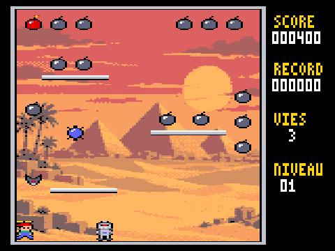
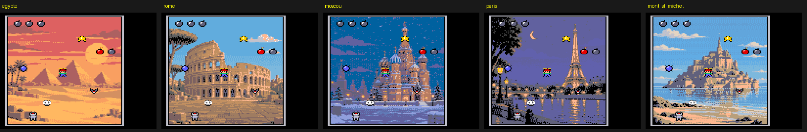

# TOTO — jeu de plates-formes pour Thomson TO9

Toto porte une casquette à hélice. Il doit ramasser les 18 bombes de chaque niveau en évitant robots, chauves-souris, boules à pics et nuages en colère. Le jeu est écrit entièrement en assembleur 6809 pour le **Thomson TO9** (1985), en 160 × 200 pixels et 16 couleurs, et testé dans l'émulateur [DCMOTO](http://dcmoto.free.fr/).

*A platform game for the Thomson TO9 8-bit computer, written in 6809 assembly (French UI).*

Le jeu a été entièrement vibecodé avec [Claude](https://claude.ai) (Anthropic) : moteur 6809, sprites, outils, simulateur et tests. Les décors ont été générés par un modèle d'image à partir de descriptions en texte ([graphismes/PROMPTS.md](graphismes/PROMPTS.md)), puis convertis pour le TO9.
*Entirely vibe-coded with Claude.*



> Nom de travail, version en cours de développement.

## Jouer

1. Construisez la disquette (voir plus bas) : vous obtenez `source/TOTO.fd`.
2. Dans DCMOTO, choisissez la machine **TO9**, puis chargez `TOTO.fd`.
3. Dans le menu du TO9, choisissez **3 - BASIC 128**, puis tapez `RUN"TOTO"`.

| Touche | Effet |
|---|---|
| ← → | marcher ; en l'air, Toto garde son élan |
| ↑ ou ESPACE | sauter ; maintenue en retombant : **planer** |
| ↓ | en l'air, arrêter l'élan |
| S | son oui / non |
| Manette 1 | directions, bouton = saut |

Le clavier du TO9 ne transmet qu'une touche à la fois : on part en courant, on saute, puis on plane. À la manette, on peut combiner les directions et le bouton.

### Règles

- **Bombes** : une bombe éteinte rapporte 100 points ; la bombe **allumée** (rouge) en rapporte 200 et allume la suivante. Quand tout est ramassé, on passe au niveau suivant.
- **Ennemis** : un toutes les 3 s, jusqu'à « niveau + 3 » (8 au plus). Ils sont plus rapides à partir du niveau 3.
  - le **robot** tombe, puis marche sur les plateformes ;
  - la **chauve-souris** poursuit Toto ;
  - la **boule** rebondit ;
  - le **nuage** dérive et descend vers Toto.
- **Vies** : un contact coûte une vie, sur 3 au total. À la fin de la partie, le bord devient rouge, le record est gardé, et une nouvelle partie démarre.

## Construire

Il faut `python3`, [Pillow](https://pypi.org/project/pillow/) et `lwasm` ([lwtools](http://www.lwtools.ca/)).

```sh
cd source
sh build.sh            # -> TOTO.BIN et TOTO.fd (décor : egypte)
sh build.sh paris      # autre décor : egypte, rome, moscou, paris, mont_st_michel
```

### Tests

Le dossier `test/` contient un simulateur TO9 (`to9sim.py`, avec le paquet [MC6809](https://pypi.org/project/MC6809/)). Il sait reconstituer l'écran **ligne par ligne, au passage du faisceau**, pour mesurer le scintillement.

```sh
pip install pillow MC6809
cd test
python3 test_toto.py        # saut, vol plané, bombes, ennemis, vies, niveaux, fin de partie, 40 s au hasard
python3 scintillement.py    # sprites entiers à l'écran avec 2 à 8 ennemis
python3 film_toto.py        # petit film -> apercus/toto.gif
```

Mesures dans le simulateur, son compris :

| Ennemis | Sprites entiers à l'écran | Images par seconde |
|---|---|---|
| 2–4 | 100 % | 50 |
| 6–8 | 100 % | 25 |

## Comment ça marche

- **Pas de sprites matériels sur le TO9.** Chaque sprite est effacé (en recopiant une copie du décor gardée en mémoire), puis redessiné.
- **Sprites compilés** : chaque image de sprite est transformée en code 6809. Les pixels transparents ne produisent aucune instruction, les octets opaques sont écrits directement, et seuls les octets mixtes lisent l'écran. Un sprite coûte environ 1 950 cycles.
- **Sans scintillement** : le TO9 n'a qu'une page d'écran, donc un sprite ne doit jamais être en cours d'effacement quand le faisceau le balaie.
  - Au retour de trame, le moteur traite d'abord les sprites du bas, avant que le faisceau y arrive.
  - Puis il traite ceux du haut, une fois que le faisceau les a dépassés.
  - Pour savoir où en est le faisceau, il utilise une horloge au cycle près : l'interruption du timer 6846 plus la lecture de son compteur.
- **Son** : 2 voix carrées et des bruitages sur le CNA 6 bits de l'extension jeux, calculés sous interruption du timer à 1 000 Hz. Cette même interruption sert d'horloge.
- **Logique** : le jeu avance à 50 tops par seconde, quel que soit le nombre d'images affichées.

Pièges rencontrés, utiles pour d'autres projets TO9 :

- **Le 6846 ne garde qu'une interruption en attente.** Masquer les interruptions plus longtemps qu'une période du timer en fait perdre une, et l'horloge comme le son se décalent.
- **Le port B du PIA jeux doit être mis en sortie** (registre de direction) pour que le CNA produise un son.
- **`LDD` recharge A et B** : il ne faut pas compter les tours d'une boucle dans B si elle contient un `LDD`.

## Fichiers

| Dossier | Contenu |
|---|---|
| `source/` | `toto.asm` (le jeu), `moteur.asm` (le moteur de sprites), `donnees.py` (décor, sprites compilés, tables), `make_fd.py` (disquette) |
| `outils/` | `sprites.py` (les sprites dessinés en lettres), `convertir_decor.py` (image → décor TO9), `lz.py`, `police.py` |
| `graphismes/` | décors sources, décors convertis, guide pour en générer d'autres |
| `test/` | simulateur TO9 et tests |
| `apercus/` | captures, planche des sprites, film |




## Licence

[MIT](LICENSE)
